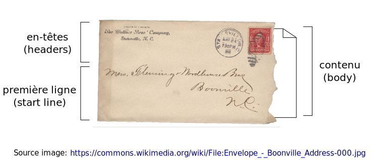

Séance 1 : prise en main
========================

.. include:: common.rst.inc
.. ifslides::

   .. include:: credits.rst.inc

Introduction
++++++++++++

Motivation
----------

Comment faire pour intégrer dans votre application :

* la météo du moment à Lyon
* une conversion Euro → Dollar (au cours en vigueur)

?

.. note::

   Comment feriez-vous pour le faire à la main?

Réponse
-------

Aller chercher l'information sur le Web.

Le Web : une plateforme de services
+++++++++++++++++++++++++++++++++++

Architecture Client-Serveur
---------------------------

* **Ressource**:
  toute unité d'information (document, image, vidéo, **données**...)
  accessible sur le Web

* **Serveur**:
  un ordinateur « contenant » des ressources, toujours connecté à Internet.

* **Client**:
  un ordinateur/smartphone/tablette...
  utilisé pour **exploiter** des ressources.

.. figure:: _static/client-server.png
   :height: 8ex

   Source image http://commons.wikimedia.org/wiki/File:Client-server-model.svg

Rôle du client
--------------

* L'exploitation des ressources par le client est souvent assimilé à leur *affichage*,
  mais c'est une simplification.

* Elle suppose toujours un **calcul**, plus ou moins complexe.

Rôle du serveur
---------------

* De même, on réduit la plupart du temps le rôle du serveur à celui d'un *fournisseur* de données.

* Or dans de nombreux cas, le serveur reçoit également des données du client :

  - requête à un moteur de recherche,
  - commande passée sur un site marchand,
  - message posté sur un mur...

* Ces données modifient l'état des ressources...

Conclusion
----------

* Le web est donc plus qu'un espace documentaire
  permettant la consultation des ressources
  qui ne seraient que des textes et des médias.

* C'est une plateforme de **services**
  permettant la consultation et la modification des ressources de tous types,
  incluant des données structurées.

Message HTTP
++++++++++++

Principe
--------

HTTP est basé sur l'échange de **messages**…:

* le client envoie un message *requête*
* le serveur retourne un message *réponse*

Chaque échange est indépendant des autres (messages auto-suffisants).

Structure générale
------------------



Structure d'une requête
-----------------------

* Première ligne

  - verbe
  - identifiant local de la ressource
  - version du protocole HTTP

* En-têtes

* Contenu facultatif (selon le verbe)


Exemples de requêtes
````````````````````

.. rst-class:: request
.. code-block:: http
 :emphasize-lines: 1

 GET /france/lyon HTTP/1.1
 Host: meteo.example.org
 User-Agent: Mozilla/5.0 (X11; U; Linux i686;
        fr; rv:1.9.1) Gecko/20090624 Firefox/3.5
 Accept: text/html,application/xhtml+xml,
        application/xml;q=0.9,*/*;q=0.8
 Accept-Language: fr,en;q=0.5
 Accept-Encoding: gzip,deflate
 Accept-Charset: UTF-8,*
 Connection: keep-alive
 Keep-Alive: 300

(pas de contenu)

.. nextslide::

.. rst-class:: request
.. code-block:: http
 :emphasize-lines: 1

 POST /passer-commande HTTP/1.1
 Host: marchand.example.org
 User-Agent: Mozilla/5.0 (X11; U; Linux i686;
        fr; rv:1.9.1) Gecko/20090624 Firefox/3.5
 Accept: text/html,application/xhtml+xml,
        application/xml;q=0.9,*/*;q=0.8
 Accept-Language: fr,en;q=0.5
 Accept-Encoding: gzip,deflate
 Accept-Charset: UTF-8,*
 Connection: keep-alive
 Keep-Alive: 300
 Content-Type: application/x-www-form-urlencoded
 Content-Length: 12345

 nom=PA+Champin&addresse=12+rue+Turing&articles=...


Structure d'une réponse
-----------------------

* Première ligne

  - version du protocole HTTP
  - code de statut
  - libellé textuel

* En-têtes

* Contenu facultatif (selon le code de statut)


Exemples de réponse
```````````````````
.. rst-class:: response
.. code-block:: none
 :emphasize-lines: 1

 HTTP/1.x 200 OK
 Date: Mon, 02 Jan 2016 22:46:26 GMT
 Server: Apache/2
 Accept-Ranges: bytes
 Content-Type: text/html; charset=utf-8
 Content-Length: 29794
 Etag: "7462-477341dcfb940;89-3f26bd17a2f00"
 Last-Modified: Mon, 02 Jan 2016 12:00:00 GMT
 Content-Location: Home.html
 Vary: negotiate,accept
 Cache-Control: max-age=600
 Expires: Mon, 02 Nov 2009 22:56:26 GMT
 Connection: close

 <!DOCTYPE html>
 <html><head><title>Météo de Lyon</title>
 ...

.. nextslide::

.. rst-class:: response
.. code-block:: none
 :emphasize-lines: 1

 HTTP/1.x 303 See also
 Date: Mon, 02 Jan 2016 22:46:26 GMT
 Server: Apache/2
 Accept-Ranges: bytes
 Location: /commande/12345
 Connection: close

 (pas de contenu)

.. nextslide::

.. rst-class:: response
.. code-block:: none
 :emphasize-lines: 1

 HTTP/1.x 404 Not Found
 Date: Mon, 02 Jan 2016 22:46:26 GMT
 Server: Apache/2
 Content-Type: text/html; charset=utf-8
 Content-Length: 2979
 Connection: close

 <!DOCTYPE html>
 <html><head><title>Cette ressource n'existe pas</title>
 ...

Codes de statut
---------------

HTTP définit 40 codes de statut, répartis en cinq catégories :

.. list-table::
   :header-rows: 1

   * - Catégorie
     - Exemple
   * - 1xx : Information
     - 100 Continue
   * - 2xx : Succès
     - 200 OK
   * - 3xx : Redirection
     - 301 Moved Permanently
   * - 4xx : Erreur client
     - 404 Not Found, 401 Unauthorized
   * - 5xx : Erreur serveur
     - 500 Internal Server Error

HTTP en Java
++++++++++++

Classes utiles
--------------

* `java.net.URL <http://docs.oracle.com/javase/9/docs/api/java/net/URL.html>`_
* `java.net.HttpURLConnection <http://docs.oracle.com/javase/9/docs/api/java/net/HttpURLConnection.html>`_

Exemple
-------

.. code-block:: java

        // préparation de la requête
        URL url = new URL("http://httpbin.org/");
        HttpURLConnection conn = (HttpURLConnection) url.openConnection();
        conn.setRequestMethod("GET"); // facultatif : c'est GET par défaut
        conn.addRequestProperty("Accept-language", "fr");
        // définition d'autres en-têtes, au besoin...

        // envoi de la requête
        conn.connect();

.. nextslide::

.. code-block:: java

        // exploitation de la réponse
        int status = conn.getResponseCode();
        String contentType = conn.getHeaderField("content-type");
        InputStream bodyStream = conn.getInputStream();

        BufferedReader bodyReader =
                new BufferedReader(new InputStreamReader(bodyStream));
        String line = bodyReader.readLine();
        while (line != null) {
            doSomethingWith(line);
            line = bodyReader.readLine();
        }


Votre travail
+++++++++++++

Votre travail
-------------

L'objectif de ce TP est d'écrire une classe qui, étant donnée une page Web,
vérifie l'état de tous les liens contenus dans cette page
(y compris les images, les feuilles de styles, etc.)
et compte combien de ces liens sont valides, brisés ou non-HTTP.

Pour réaliser ce travail, clonez  `ce dépôt git`__,
et complétez la classe ``LinksChecker``.
La classe ``TestTP1`` contient un jeu de test
qui vous permet de vérifier la conformité de votre implémentation.

__ https://forge.univ-lyon1.fr/PA.Champin/apiweb_tp1/

.. note::

  La classe ``TestTP1`` utilise notamment `cette page`__,
  qui contient un échantillon représentatif des types de liens que doit pouvoir gérer votre programme.

__ ./_static/test_liens.html


Indication : liens relatifs
---------------------------

De nombreux liens présents sur une page HTML sont des liens *relatifs*.

La classe ``URL`` permet heureusement de construire une URL absolue,
à partir d'une URL de base (``URL``) et d'un lien relatif (``String``) :

.. code-block:: java

  URL lienAbsolu = new URL(base, lienRelatif);

Indication : extraire les liens d'un code HTML
----------------------------------------------

Pour extraire les URLs des liens,
on pourra utiliser l'`expression régulière`__ suivante :
``(src|href)\s*=\s*["']([^"']*)["']``

.. code-block:: java

      String htmlCode = "(...)";
      Pattern regex = Pattern.compile(
          "(src|href)\\s*=\\s*[\"']([^\"']*)[\"']");
      Matcher matcher = regex.matcher(htmlCode);
      while (matcher.find()) {
          test_link(matcher.group(2));
      }


__ https://docs.oracle.com/javase/9/docs/api/java/util/regex/package-summary.html
